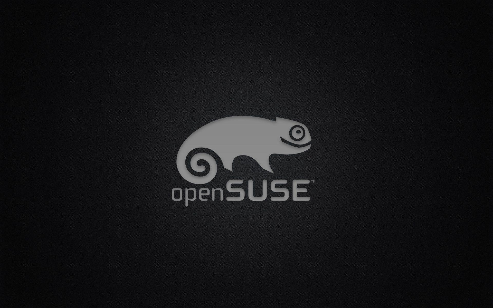
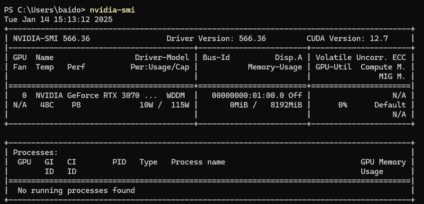

**AI大语言模型学习笔记**

# **0. 前言**
我写这个笔记用来记录我最近几个月学习大语言模型的过程。

写的代码基本都是看网上的资料学习的，原创的代码内容很少。

感谢各位大佬的开源资料。

主要学习资料就是github上的[THUDM](https://github.com/THUDM)

网上很多教程都是文字为主（应该是MD插入不方便吧）。
我就做了一个图片很丰富的，去什么地方执行什么操作，我都截图红色框框框出来，方便初学者对照执行。

学习大预言模型不仅仅是简单调用，还包括按私有化场景开发垂直应用。针对某个具体的领域，深挖AI的潜力。

# **1.准备环境**
## **1.0 硬件基础**
### **显卡：3070以上。**
大语言模型主要依赖英伟达的CUDA计算模块，使用CPU等可以进行模拟和运行，但仅限于可以跑通，但运行消耗的时间超过GPU运行的7-10倍以上，而且非常消耗内存（20G起）。所以如果想要本地运行大语言模型，推荐使用3070以上的英伟达显卡。我这些程序在我的3070、3080、4090显卡、在公司A40显卡，可以正常运行。
#### **内存：32Gb以上**
虽然运算主要跑在GPU，但我发现其实内存占用也挺大的，我2台32G 1台64G内存的电脑，经常跑起来会占用内存超过16G，推荐有条件最好有32G以上内存。
#### **CPU: 主流即可**
我几台电脑CPU是 5900HX，11800H，13900KF 都能顺利运行，整个训练和推理不怎么依赖CPU，主流即可。
## **1.1 软件基础**
#### **操作系统：Windows 11.**
网上的教程都是推荐使用Linux ubuntu. 我个人是很喜欢Linux的，但大部分用户电脑不可能为了学习大语言模型额外安装一个操作系统，所以我尽量在windows环境下完成这些AI的开发、训练和应用。有关脚本(.sh)和程序我都修改为可以在windows环境下直接运行的了。

为了安装deepspeed，我拿一台电脑也尝试安装了Ubuntu,结果配置环境问题也很多，最终放弃。考虑过虚拟机安装Linux，但网上资料似乎说虚拟后显卡性能打折不少，就放弃了虚拟方案。
#### **英伟达显卡最新驱动和CUDA:**
[英伟达驱动下载](https://developer.nvidia.com/cuda-downloads?target_os=Windows&target_arch=x86_64&target_version=11&target_type=exe_local)

我写笔记的时候，显卡驱动版本是

#### **Python环境：**
请安装Python 3.10.11  [下载地址](https://www.python.org/ftp/python/3.10.11/python-3.10.11-amd64.exe)

#### **Pycharm Python IDE:**
当然不用ide，直接通过powerShell命令行来运行是可以的，但我觉得还是pycharm方便一点。推荐直接使用jetbrains出品的toolbox来安装和管理IDE。

安装后启动toolbox，选择pycharm community社区版安装即可。

[下载地址](https://www.jetbrains.com/zh-cn/toolbox-app/download/download-thanks.html?platform=windows)

Git安装

[Git下载地址](https://github.com/git-for-windows/git/releases/download/v2.47.1.windows.1/Git-2.47.1-64-bit.exe)

如果不习惯用命令行，可以用 git GUI的 乌龟git

[乌龟git下载链接](https://download.tortoisegit.org/tgit/2.17.0.0/TortoiseGit-2.17.0.2-64bit.msi)

## **1.2 心理准备**
学习大语言模型训练比我之前学习其他的IT技术，都要更加花费时间和精力。过程中经常会报各种错，查很多资料都未必能解决。

我这个笔记会把从0开始搭建环境讲一次，如果遇到不可解决的困难，可以直接下载我打包好的文件，解压导入pycharm，设置编译器即可运行，简单粗暴。

希望大家要努力，不要搞成《大语言模型学习从入门到放弃》。

# **2.ChatGLM本地部署**

请参考我的另外一个项目，完成本地GLM的部署。

[GLM本地部署](https://github.com/baidongyi/xbbGLM)

# **3.LangChain本地部署**

## **3.1 代码拉取** 

## **3.2 模型下载**

# **4.LangChain 应用**
## **4.1 本地文件资料搜索**
## **4.2 与ChatGLM集成，实现基于本地知识库问答**

